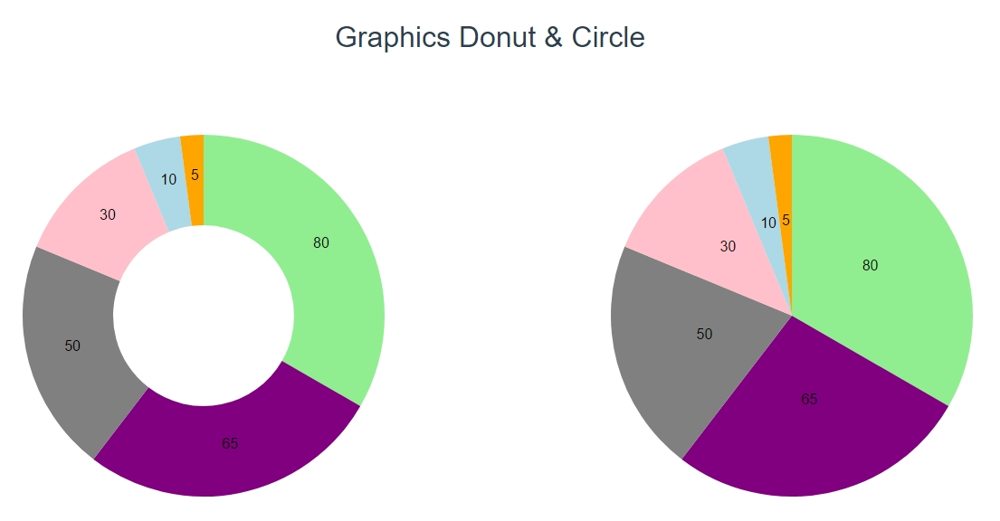

# Vue.js + D3.js - Solène Ramis

> Librairie D3.js

### Graph_v1 :
```
Axes x et y en svg
```


<hr>

### Graph_v2 :
```
Graphique en bars avec transition horizontale + axe de temps (années)
```


<hr>

### Graph_v3 :
```
Graphique en donut et circulaire avec transions circulaires
```


<hr>

### Graph_v4 :
```
Graphiques en air avec data en .json
```


<hr>

### ZoomAxis :
```
Test Zoom / Pan axis
The D3 Zoom, d3.zoom(), constructs a zoom that creates an even listener to handle zoom gestures (mouse and touch) on the SVG elements you apply the zoom.
The Panning behavior allows us to pan along the X and Y axis.

```


<hr>

### axisHover :
```
Test Axis hover :
  * graphique avec barre verticale
  * graphique avec bar horizontale & verticale + informations data

```

